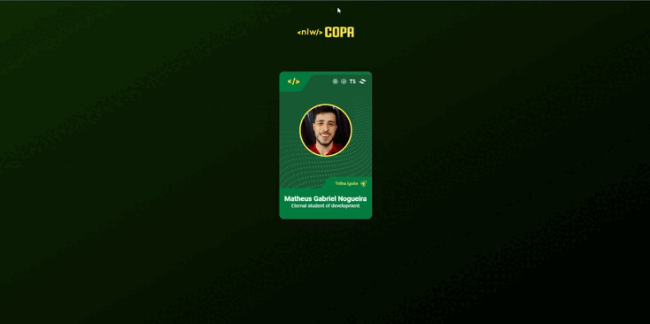

<h1 align="center"> Card Copa NLW </h1>

  <a href="#-tecnologias">Tecnologias</a>&nbsp;&nbsp;&nbsp;|&nbsp;&nbsp;&nbsp;
  <a href="#-projeto">Projeto</a>&nbsp;&nbsp;&nbsp;|&nbsp;&nbsp;&nbsp;
  <a href="#-layout">Layout</a>&nbsp;&nbsp;&nbsp;|&nbsp;&nbsp;&nbsp;
  <a href="#-redes">Redes</a>

---

  

---

## 🚀 Tecnologias

Esse projeto foi desenvolvido com as seguintes tecnologias:

-  HTML
-  CSS
-  JavaScript

## 💻 Projeto

O Projeto é um Card com um Avatar e Nome de um Usuário que irá participar de alguma das trilhas Explorer ou Ignite da [Rocketseat](https://www.rocketseat.com.br/)

## 🔖 Layout

Você pode visualizar o layout do projeto através [DESSE LINK](https://www.figma.com/file/PNjWpuhGctTMQryly55msD/NLW-Copa-Card-Copy?fuid=988583520289453327). É necessário ter conta no [Figma](https://figma.com) para acessá-lo.

---

## 🔗 Redes

Estas são minhas redes sociais. Sinta-se a vontade para mandar uma mensagem.

-  [Linkedin](https://www.linkedin.com/in/eomgn/)
-  [Instagram](https://www.instagram.com/matheuzngr/)
-  [Twitter](https://twitter.com/eomgn)
